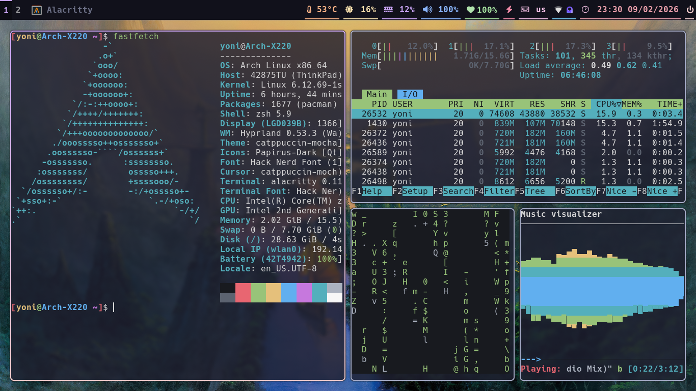

# Arch-Dotfiles ([Yonatan Shaked](https://yonatanshaked.com)'s dotfiles)
My dotfiles for Arch Linux.



**Window Manager**: Hyprland

**Status Bar**: Waybar

**Terminal**: Alacritty

**Launcher**: Rofi

**Editor**: Neovim

**File Manager**: Pcmanfm

**Browser**: Brave

---

## Setup

> ⚠️ Assumes Arch Linux was installed with archinstall script and HyprLand chosen as DE.

### 1. Clone the repository
```bash
git clone https://github.com/YonatanShaked/Arch-Dotfiles.git
cd Arch-Dotfiles
```

### 2. Install official repository packages
All explicitly required pacman packages are listed in:

```
static/pkgs.txt
```

Install them with:
```bash
sudo pacman -S --needed - < static/pkgs.txt
```

### 3. Install `yay` (AUR helper)
```bash
sudo pacman -S --needed base-devel
git clone https://aur.archlinux.org/yay.git
cd yay
makepkg -si
cd ..
```

### 4. Install AUR packages
AUR packages are listed in:

```
static/aur_pkgs.txt
```

Install them with:
```bash
yay -S --needed - < static/aur_pkgs.txt
```

### 5. Apply dotfiles
```bash
stow -v -t $HOME dotfiles
```

### 6. Change default shell to zsh
```bash
chsh -s /bin/zsh
```

Log out and back in for it to take effect.

---

## Default Desktop Artwork

Thomas Thiemeyer's *The Road to Samarkand* ([fb](https://www.facebook.com/t.thiemeyer/), [insta](https://www.instagram.com/tthiemeyer/), [shop](https://www.redbubble.com/de/people/TThiemeyer/shop))
